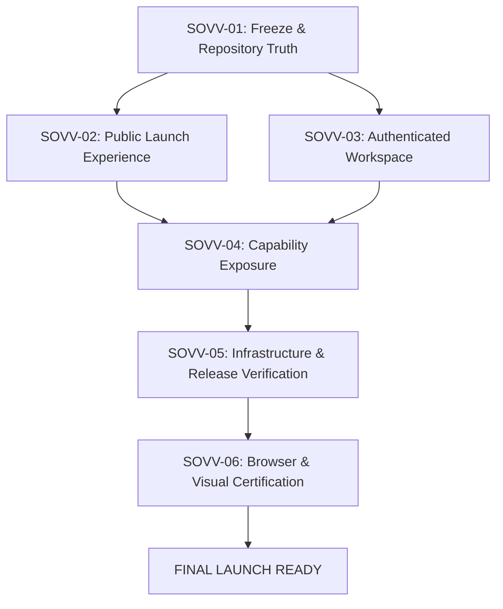

# Sovereign.OS — Final Launch Implementation Plan & Execution Graph

## 1. Goal Description

Take Sovereign.OS from the verified current repository and deployment state (`d1f0e51b9d8bb3900007eb9527bd8e143dd01ee4`) to a production-ready, visually coherent, fully verified public launch at `sovereign.defrag.app` and `app.defrag.app`.

This is not a greenfield build or an architectural rewrite. It exposes existing backend and client capabilities through a quiet, text-first personal AI workspace, strengthens the public narrative (Self → People → Systems), enforces strict protected boundaries around consent, authorization, Baseline, D1, and Stripe, and executes a verifiable, single-deploy release pipeline.



---

## 2. Protected, Mutable & Conditional Surface Map

### Protected Surfaces (Zero Alteration / Non-Negotiable Contracts)
Any modification requires formal exception evidence and strict regression tests:
- **Authentication & Sessions**: Passkey WebAuthn (`auth-passkeys.ts`), Magic link flow (`auth-public.ts`), session verification (`auth-session.ts`, `d1-session.ts`), CSRF / Same-Origin enforcement.
- **Baseline Engine & Computation**: Astronomical coordinate calculation (`baseline-engine.ts`, `baseline-facets.ts`, JPL Horizons interface), certainty boundaries, geocentric privacy.
- **Answer Contract & Safety**: `sovereign-answer.v2` JSON schema (`recognition.ts`, `sovereign.ts`), input/output safety classifiers (`safety.ts`, `input-safety.ts`), grounded non-diagnosis policy.
- **Authorization & Relational Consent**: Multi-party consent model (`db/people.ts`, `consent_grants`), invitation lifecycle, system membership permission verification (`db/product.ts`).
- **Billing & Entitlements**: Stripe webhook signature verification, checkout/portal session generation (`billing/stripe.ts`), daily AI neuron budgeting & monthly turn limits, deterministic feature gate checking (`db/entitlements.ts`).
- **Database Migrations & Data Retention**: Immutable D1 migrations up to `0019_deprecate_manual_capacity`, on-demand private export without artifact storage, deletion lifecycle (`deletion_jobs`).

### Mutable Surfaces (UX Presentation, Microcopy & Ergonomics)
- **Public Surface**: `PublicLanding.tsx`, `PublicHowItWorks.tsx`, `PublicPricing.tsx`, `PublicFAQ.tsx`, `public.css`.
- **Workspace Surface**: `SovereignIntelligenceWorkspace.tsx`, `workspace.css`, `app-shell.css`, `design-system.css`.
- **Interaction & Components**: Composer layout, Context Drawer (`ContextPanel`), Answer Action chips (`Refine`, `Sources`, `Save to Library`), Library retrieval UX, responsive drawers, typography tokens.

### Conditional Surfaces (Require Proof of Inadequacy)
- **Worker Routing**: New endpoints in `apps/sovereign-worker/src/index.ts` or `entry.ts` only if existing routes cannot support explicit authorized context injection.
- **Client State**: Local state structures in `SovereignIntelligenceWorkspace.tsx` only if backwards compatible with persisted thread events.

---

## 3. Execution Control — Mandatory Before Any Code Change

The repository is the implementation source of truth.
This document is the source of truth for final-launch intent.

If the repository and this document disagree, the agent **MUST NOT** silently choose one.

The agent must:
1. Identify the discrepancy;
2. Determine which behavior is currently live and enforced in production;
3. Determine whether the requested launch outcome is already satisfied;
4. Identify the smallest safe change required;
5. Document the discrepancy and decision;
6. Verify the decision against existing tests and contracts;
7. Only then modify code.

No protected surface may be changed merely to make the implementation conform to this document.

Protected surfaces include authentication, sessions, authorization, Baseline computation, certainty models, sovereign-answer.v2, safety classifiers, consent, invitations, People, Systems permissions, Stripe verification, entitlements, D1 migrations, privacy/retention, export, and existing production API contracts.

Any proposed change to a protected surface requires explicit evidence that the existing implementation cannot satisfy the launch requirement.

The default action sequence is:
```text
EXPOSE EXISTING CAPABILITY
  ↓ before
EXTEND EXISTING CAPABILITY
  ↓ before
CREATE NEW CAPABILITY
  ↓ never
REPLACE EXISTING CAPABILITY (unless the repository proves replacement is necessary)
```

Autonomous Execution Rule:
> **Stop only for**: protected-surface modifications, architecture changes, production data migrations, auth changes, Stripe/billing contract changes, AI provider changes, unresolved destructive operations, failing release invariants, or ambiguities that materially alter product behavior.
> All ordinary subtasks proceed autonomously against task-gated verification.

---

## 4. Six Major Implementation Tasks (SOVV-01 through SOVV-06)

### SOVV-01 — Freeze + Repository Truth
- **Objective**: Establish canonical baseline, verify clean working tree, lock SHA, validate full test suite, and reconcile data retention and entitlement accounting contracts.
- **Specific Verification Gates**:
  1. **Retention Contract Verification**: Inspect `deletion_jobs`, privacy documentation, thread/message retention, Library retention, current-condition expiry, export behavior, and background jobs (`jobs.ts`). Determine actual enforced timelines.
  2. **Entitlement Contract Verification**: Inspect Free vs Sovereign+ turn/neuron accounting, daily budget vs monthly turn allocations, UTC reset logic, Stripe price mapping, and public pricing alignment.
- **Dependencies**: None.
- **Allowed Files**: Read-only inspection; validation logs and reports.
- **Protected Files**: Entire repository tree.
- **Verification Commands**:
  ```bash
  git status --short
  git rev-parse HEAD
  git rev-parse origin/main
  pnpm verify:foundation
  pnpm typecheck
  pnpm test
  pnpm build
  ```
- **Acceptance Criteria**: Working tree clean on `origin/main`, zero test failures, dry-run build succeeds, retention and entitlement contracts fully documented with zero unresolved discrepancies.
- **Rollback Condition**: Immediate halt if SHA mismatch or uncommitted dirty changes detected.

---

### SOVV-02 — Public Launch Experience
- **Objective**: Align public marketing pages (`PublicLanding.tsx`, `PublicHowItWorks.tsx`, `PublicPricing.tsx`, `PublicFAQ.tsx`) to the authoritative launch narrative:
  - **Hero**: *“Know yourself. Understand your people. See the whole system.”*
  - **Supporting**: *“A private personal AI that starts with your Baseline and helps you make sense of real life — from your own patterns to the people and systems around you.”*
  - **CTAs**: Primary: *“Build your Baseline”*, Secondary: *“See how it works”*.
  - **Tiers**: Free (10 monthly turns, Baseline, Today, Explore) vs Sovereign+ (300 monthly turns, People, Systems, Library continuity).
- **Dependencies**: SOVV-01.
- **Allowed Files**:
  - `apps/web/src/PublicLanding.tsx`
  - `apps/web/src/PublicHowItWorks.tsx`
  - `apps/web/src/PublicPricing.tsx`
  - `apps/web/src/PublicFAQ.tsx`
  - `apps/web/src/public.css`
  - `apps/web/src/design-system.css`
- **Protected Files**: Auth routes, Worker API contracts, D1 schemas, Stripe keys.
- **Verification Commands**:
  ```bash
  pnpm --filter @sovereign/web test
  pnpm --filter @sovereign/web typecheck
  pnpm --filter @sovereign/web build
  ```
- **Acceptance Criteria**: Typography, contrast, touch targets, and hero copy match launch specification with zero regression on automated tests.
- **Rollback Condition**: Revert modified TSX/CSS files if viewport contracts or public snapshot tests fail.

---

### SOVV-03 — Authenticated Workspace Cohesion
- **Objective**: Ensure the authenticated workspace (`SovereignIntelligenceWorkspace.tsx`) is centered strictly on **Conversation**, supported cleanly by **Context**, **Work**, and **Understanding**, eliminating unnecessary card clutter.
- **Dependencies**: SOVV-01.
- **Allowed Files**:
  - `apps/web/src/SovereignIntelligenceWorkspace.tsx`
  - `apps/web/src/workspace.css`
  - `apps/web/src/app-shell.css`
- **Protected Files**: Worker runtime, authentication session cookies, database migrations.
- **Implementation Steps**:
  1. Refine composer to lead with `Ask Sovereign…` with accessible keyboard submit (`Enter` to send, `Shift+Enter` for newline).
  2. Provide prominent `＋ Add to this question` trigger that toggles the Context Drawer.
  3. Ensure active context indicators clearly show what is active for the current turn (Baseline, Current conditions, Selected Person, Selected System, or Library items).
  4. Preserve recent conversations rail with fast thread resumption.
- **Verification Commands**:
  ```bash
  pnpm --filter @sovereign/web test
  pnpm typecheck
  ```
- **Acceptance Criteria**: Workspace renders smoothly with zero unhandled exceptions on thread switching, composer interaction, or navigation.
- **Rollback Condition**: Revert workspace changes if thread state normalization breaks existing conversations.

---

### SOVV-04 — Capability Exposure
- **Objective**: Expose all existing backend capabilities in the user interface without inventing duplicate engines:
  1. **Context / Prompt Drawer**:
     - *Your Baseline*: Select specific facets (How I decide, How I communicate, How I connect, How I respond under pressure, Boundaries, Leadership, Shadow, Gift, Alignment).
     - *What's Happening Now*: Current situation, recent observation, decision, conversation pressure.
     - *People*: Add a person, invite privately, select permitted connection.
     - *Systems*: Add a family, household, team, workplace.
     - *From Your Library*: Select a saved understanding to carry into the question.
  2. **Answer Actions**:
     - *Save to Library*: Calls `saveLatestInsightModule` / `/api/v1/library` to persist approved understandings.
     - *Sources*: Inspect exact Basis values, calculation timestamps, and uncertainty levels.
     - *Refine*: *"That’s not quite right"* with options: *Correct something*, *Add what happened*, *Ask another way*.
  3. **Library Continuation**:
     - *"Ask about this"* injects saved understanding as explicit authorized context into a new or active thread.
- **Dependencies**: SOVV-02, SOVV-03.
- **Allowed Files**:
  - `apps/web/src/SovereignIntelligenceWorkspace.tsx`
  - `apps/web/src/workspace.css`
  - `apps/sovereign-worker/src/index.ts` (only for wiring existing product functions if parameter missing)
- **Protected Files**: Core Baseline math, Stripe webhooks, D1 schema, encryption secrets.
- **Verification Commands**:
  ```bash
  pnpm --filter @sovereign/web test
  pnpm --filter @sovereign/worker test
  pnpm test
  ```
- **Acceptance Criteria**: Users can add context facets, inspect sources, trigger refinements, save understandings to the Library, and reference saved understandings in future prompts.
- **Rollback Condition**: Revert capability additions if API contracts or D1 queries throw errors.

---

### SOVV-05 — Infrastructure & Release Verification
- **Objective**: Run full pre-flight verification gates, Cloudflare build verification, secret scans, migration validations, and dry-run release orchestration.
- **Dependencies**: SOVV-04.
- **Allowed Files**:
  - `scripts/`
  - `wrangler.jsonc`
- **Protected Files**: Production live secrets, external production state.
- **Verification Commands**:
  ```bash
  pnpm verify:foundation
  pnpm verify:migrations
  pnpm scan:secrets
  pnpm scan:production-fixtures
  pnpm verify:release-config
  pnpm verify:intelligence-release
  pnpm verify:visual-intelligence
  pnpm verify:premium-platform
  pnpm typecheck
  pnpm test
  pnpm build
  pnpm verify:worker-bundle-size
  pnpm verify:cloudflare-build
  ```
- **Acceptance Criteria**: 100% pass rate across all verification scripts, zero high-risk secrets, bundle size within Cloudflare limits.
- **Rollback Condition**: Do not proceed to deployment if any single verification check fails.

---

### SOVV-06 — Browser & Visual Certification
- **Objective**: Execute end-to-end visual and functional audits across desktop and mobile viewports.
- **Dependencies**: SOVV-05.
- **Verification Matrix**:
  1. **Public Landing**: Hero hierarchy, navigation drawer, pricing cards, FAQ disclosures, typography rendering.
  2. **Auth & Onboarding**: Magic link / Passkey entry, 3-step Baseline creation, plan intent selection.
  3. **Workspace Core**: First question → streaming/processing → `sovereign-answer.v2` rendering → Sources modal → Save to Library.
  4. **Context Drawer**: Baseline facet selection, People invitation modal, Systems creation, Library retrieval.
  5. **Account & Billing**: Free tier limits enforcement, Stripe upgrade redirect, data export & deletion settings.
  6. **Mobile Responsiveness**: Viewport safe-areas, touch target sizes ($\ge 44\text{px}$), zero horizontal overflow.
- **Acceptance Criteria**: Signed visual acceptance report with zero high-severity UI or functional defects.
- **Rollback Condition**: Fix UI defects in `apps/web/src/` and re-run SOVV-05 before deployment.

---

## 5. Deployment & Release Invariant Gate

```text
SOURCE SHA == TESTED SHA == RELEASE SHA == DEPLOYED VERSION == /ready SHA == LIVE EDGE
```

### Production Release Execution Sequence:
1. `git rev-parse HEAD` must equal `origin/main`.
2. `pnpm verify:cloudflare-build` must pass on exact SHA.
3. `pnpm production:release:text` deploys Worker + Assets to Cloudflare.
4. Live `/ready` health check validation:
   - `ready: true`
   - `sha: <EXACT_SHA>`
   - `migrationVersion: 0019_deprecate_manual_capacity`
   - `dependencies.d1: ok`
   - `dependencies.aiFreeCapacity: configured`
   - `dependencies.durableObjects: configured`
   - `dependencies.ai: configured`
   - `dependencies.baselineEngine: configured`
